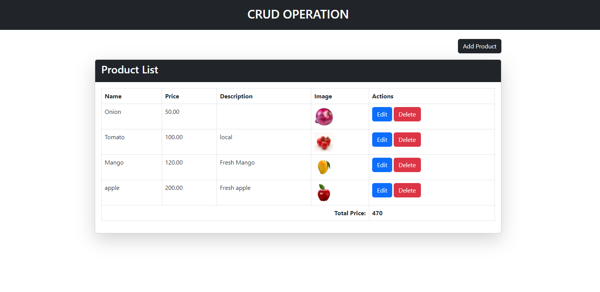
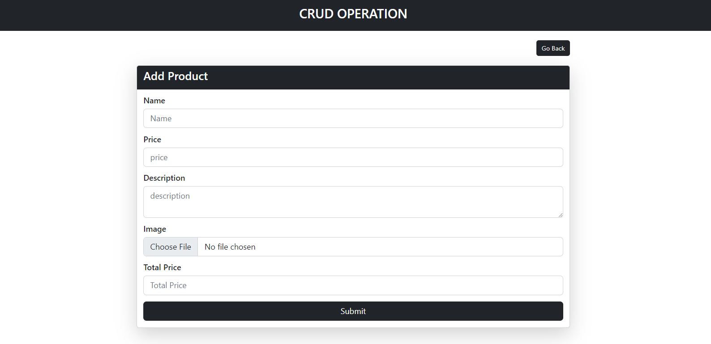
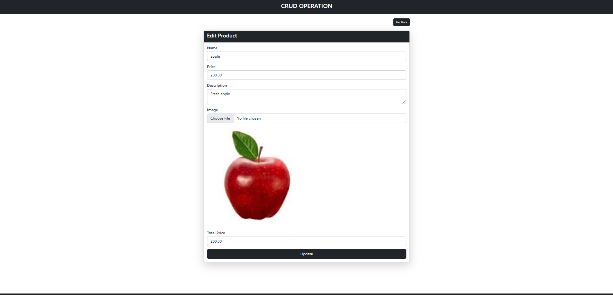
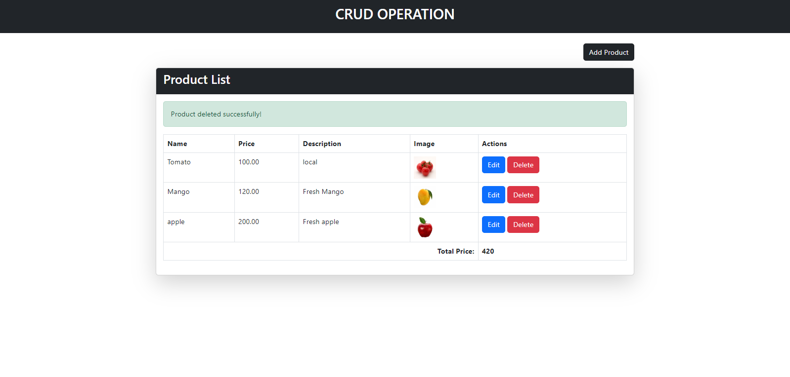

<p align="center"><a href="https://laravel.com" target="_blank"></a></p>

# Laravel Application Deployment on Netlify

This repository contains a Laravel application that is configured to be deployed on Netlify, a platform primarily designed for static site hosting. Here’s how you can set it up:

## Prerequisites

- [GitHub](https://github.com/) account
- [Netlify](https://www.netlify.com/) account

## Getting Started

1. **Clone the Repository**

   ```bash
   git clone https://github.com/your-username/your-repository.git
   cd your-repository

2. **Install Dependencies**
   Ensure you have Composer installed. Then, run:
   ```bash
    composer install

## Configure Environment Variables

To set up environment variables required for your Laravel application on Netlify:

1. **Go to your Netlify Site Dashboard**

   - Log in to [Netlify](https://www.netlify.com/).
   - Select your site from the dashboard.

2. **Navigate to Site Settings**

   - Click on **Site settings** in the top navigation bar.

3. **Configure Environment Variables**

   - Scroll down to **Build & deploy** settings and click on **Environment**.
   - Add environment variables by clicking on **Edit variables**.
   - Enter the necessary environment variables like database credentials or API keys.
   - Click **Save** to apply the changes.

Example of environment variables commonly used in Laravel:

```bash
DB_CONNECTION=mysql
DB_HOST=your_database_host
DB_PORT=3306
DB_DATABASE=your_database_name
DB_USERNAME=your_database_username
DB_PASSWORD=your_database_password
```
```bash
API_KEY=your_api_key
```

- Ensure you replace placeholders (`your_database_host`, `your_database_name`, etc.) with your actual database credentials or API keys. Managing environment variables securely is crucial for protecting sensitive information in your Laravel application.

<h2>Output</h2>

*Home Page*


*Create Panel*


*Update Page*


*Delete Page*


